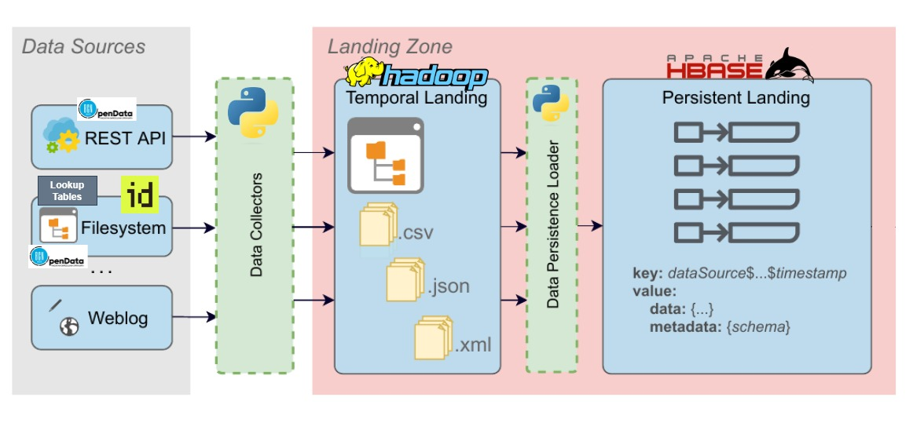
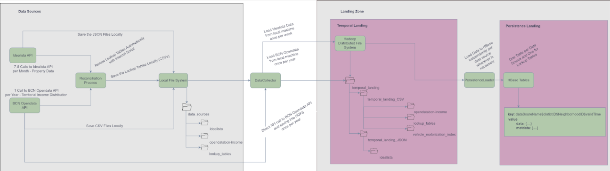

# Big Data Management - Universitat Politècnica de Catalunya
## Implementation of a (Big) Data Management Backbone
### Barcelona Rentals - Territorial Income Distribution - Vehicle Motorization Index 
This part of the project is focused on the `Temporal and Persistent Zones` of the Data Management Backbone
***

### System's Design and BPMN

In the following two figures the `system's design` and its `BPMN` are depicted.




### Instructions for Executing the Code

- Download Python version 3.10
- Clone this repository locally
  - ``` git clone https://github.com/odyskypa/hdfs-hbase-temporal-persistent-zones.git```
- Create a virtual environment with Python 3.10 interpreter and run the following command to install the required libraries:
  - ```
      pip install requirements.txt
    ```
- Create a folder `data_sources` inside `hdfs-hbase-temporal-persistent-zones` folder.
  - Create a folder per data source inside `data_sources` folder. E.g.:
    - `./data_sources/idealista`
    - `./data_sources/opendatabcn-income`
    - `./data_sources/lookup_tables`
  - Insert the raw data source files inside the appropriate folder.
- Add a `.env` file inside BDM folder, including the following parameters with their appropriate values:
  - ```
    HDFS_HBASE_HOST='....' #Change This
    HDFS_PORT=9870
    HBASE_PORT=9090
    HDFS_USER='....' #Change This
    GLOBAL_DATA_DIR_PATH='./data_sources'
    TEMPORAL_LANDING_DIR_PATH = '/temporal_landing'
    TEMPORAL_LANDING_CSV_DIR_PATH= 'temporal_landing_CSV'
    TEMPORAL_LANDING_JSON_DIR_PATH= 'temporal_landing_JSON'
    OPEN_DATA_API_KEY= '...' #Change This
    ```
- For executing `data-collection` functionality in order to move data from the local machine or the Open Data BCN API to HDFS, make use of the following command:
  - ``` 
    python main.py data-collection
    ```
- Otherwise, for executing `persistence-loading` functionality in order to move the available data of the `Temporal Landing Zone` to the `Persistence Landing Zone`, use the following command:
  - ```
    python main.py persistence-loading
    ```

### Limitations
  
There is a problem with `macOS` systems (mainly with the paths), and it needs to be investigated.
Execution in `Windows` machines is completed smoothly.
